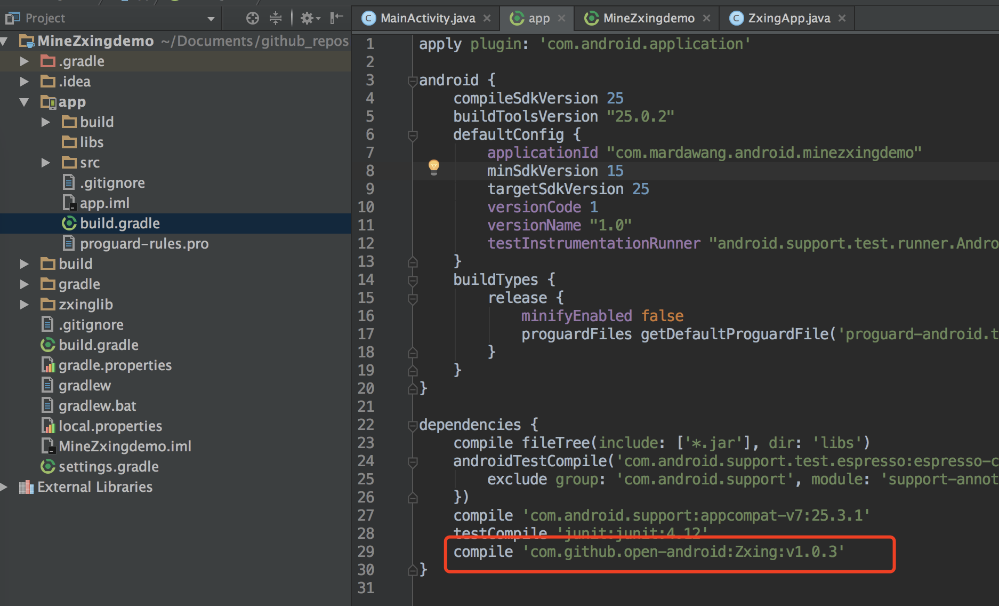

# 二维码的识别和生成demo演示
---

# 运行页面

## 使用步骤

### 1. 在project的build.gradle添加如下代码(如下图)

	allprojects {
	    repositories {
	        maven { url "https://jitpack.io" }
	    }
	}

### 2. 在Module的build.gradle添加依赖

    compile 'com.github.open-android:Zxing:v1.0.3'

    

### 3.清单文件添加权限

	<uses-permission android:name="android.permission.WRITE_EXTERNAL_STORAGE" />
        <uses-permission android:name="android.permission.CAMERA" />
        <uses-feature android:name="android.hardware.camera" />
        <uses-feature android:name="android.hardware.camera.autofocus" />

        <uses-permission android:name="android.permission.FLASHLIGHT" />
        <uses-permission android:name="android.permission.VIBRATE" />

### 4.调用扫描和生成二维码功能

#### 4.1打开CaptureActivity扫描
	
    startActivity(new Intent(MainActivity.this, CaptureActivity.class));

#### 4.2传入内容生成二维码

	String content = mEt.getText().toString().trim();
    Bitmap bitmap = null;
    try {
        bitmap = BitmapUtils.create2DCode(content);
        mImage.setImageBitmap(bitmap);
    } catch (WriterException e) {
        e.printStackTrace();
    }

	
* 整个demo其实很简单，主要得感谢 谷歌的工程师们开源的Zxing jar包 ,如果你觉得这个库对你有那么点用处,请star我一下吧~~~，谢谢！

	
